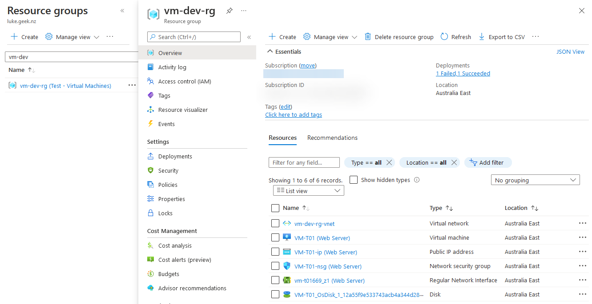

# Hidden Tags in Microsoft Azure

---

**Principal author**: [Luke Murray](https://learn.microsoft.com/users/lukemurraynz/?WT.mc_id=AZ-MVP-5004796)

---

[Tags](https://learn.microsoft.com/azure/azure-resource-manager/management/tag-resources?tabs=json&WT.mc_id=AZ-MVP-5004796 "Use tags to organize your Azure resources and management hierarchy") in Microsoft Azure are pivotal to resource management, whether it's used for reporting or automation.

But sometimes, you need that extra bit of information to help discover what resources are for, or you may want to add information to a resource that isn't directly displayed in the portal, especially when complex tags are in use that might be used in automation initiatives.

This is where 'hidden' Azure Tags come in handy.

Tags starting with the prefix _'hidden-'_ will not be displayed under Tags in the Azure Portal; however, they will be displayed in the resource metadata and utilised by PowerShell and Azure CLI for automation initiatives.

Examples are:

| Tags | Value |
| --- | --- |
| hidden-title | Web Server |
| hidden-ShutdownAutomation | Yes |

## hidden-title

As mentioned above, every tag with 'hidden-' in front of it will be hidden in the Azure Portal.

You may have noticed that some resources in Azure, especially if the Azure ARM (Azure Resource Manager) creates them and the name is GUID-based, have a '(name)' around them after the resource name because of the hidden-title tag.

You may have noticed that some resources in Azure, especially if the Azure ARM _(Azure Resource Manager)_ creates them and the name is GUID based, have a '(name)' around them after the resource name; this is because of the hidden-title tag.

The hidden-title tag is handy for picking resources that belong to a specific service or application.

An example is below:



However, if I navigate to the Overview page and click JSON View, I can see the hidden tags in the resource metadata.


## hidden-tags

### Azure Portal

You can use the Azure Portal directly to add the Tags to apply hidden tags.


You can remove the Tag by adding the hidden-tag again and keeping the value empty _(i.e. blanking out the hidden-title will remove the title)_. However, it will still be against the metadata _(Resource Graph)_ as a Tag that exists (as seen in the screenshot below) - it is much cleaner to use PowerShell.


### PowerShell

Get-AzTag and Remove-AzTag do not display the hidden tags. To add and remove the tags, you must add them through 'Update-AzTag' and 'Replace' or 'Merge' to overwrite them, requiring the Resource targetted by Resource ID.

A handy snippet to use to add/remove the Tags on individual or multiple resources is:

``` PowerShell

$replacedTags = @{"hidden-title" = "Web Server"; "hidden-ShutdownAutomation" = "Yes"}
$resouceGroup = 'vm-dev-rg'
Get-AzResource -ResourceGroupName $resouceGroup | Select-Object ResourceId | Out-GridView -PassThru | Update-AzTag -Tag $replacedTags -Operation Merge

```
This snippet will gather all the resources in your Resource Group and then select their Resource IDs; the script will then prompt with a GUI, allowing you to select which resources or resources you want to update your tags on. Once you click Ok, it will update the Tags on the selected resources.


You may be wondering if the Hidden tags are useful for automation, but if the 'Get-AzTag' cmdlet doesn't work, how can I retrieve the resources? It's a good question, and that is where 'Get-AzResource' comes to the rescue.

Examples are:

``` PowerShell

# Retrieves all Azure resources that have the tag 'hidden-ShutdownAutomation'
Get-AzResource -TagName hidden-ShutdownAutomation

# Retrieves all Azure resources that have a tag value of 'Yes'
Get-AzResource -TagValue Yes

# Sets the variables $TagName and $TagValue to 'hidden-title' and 'Web Server', respectively
$TagName = 'hidden-title'
$TagValue = 'Web Server'

# Retrieves all Azure virtual machines that have the tag 'hidden-title' with a value of 'Web Server'.
# Filters the results to only include virtual machines with a resource type of 'Microsoft.Compute/virtualMachines'
Get-AzResource -TagName $TagName -TagValue $TagValue | Where-Object -FilterScript {
    $_.ResourceType -like 'Microsoft.Compute/virtualMachines' 
}

```

### Azure Bicep

You can also add the Tags with Azure Bicep.

Example is:

```
param resourceTags object = {
   hidden-title: 'Web Server'
   hidden-ShutdownAutomation: 'Yes'
}

tags: resourceTags
```

## Next steps

If interested, the following Microsoft Learn documentation is worth reading to delve deeper into the world of Tags.

* [Use tags to organize your Azure resources and management hierarchy](https://learn.microsoft.com/azure/azure-resource-manager/management/tag-resources?WT.mc_id=AZ-MVP-5004796)
* [Tag support for Azure resources](https://learn.microsoft.com/azure/azure-resource-manager/management/tag-support?WT.mc_id=AZ-MVP-5004796)
* [The Parent Tag: cm-resource-parent for Azure cost management](https://techcommunity.microsoft.com/t5/itops-talk-blog/the-parent-tag-cm-resource-parent-for-azure-cost-management/ba-p/3727771?WT.mc_id=AZ-MVP-5004796)
