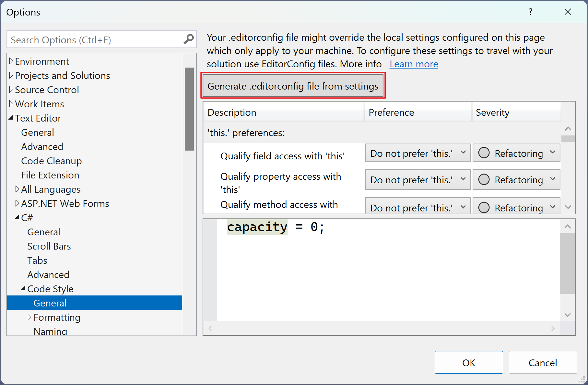
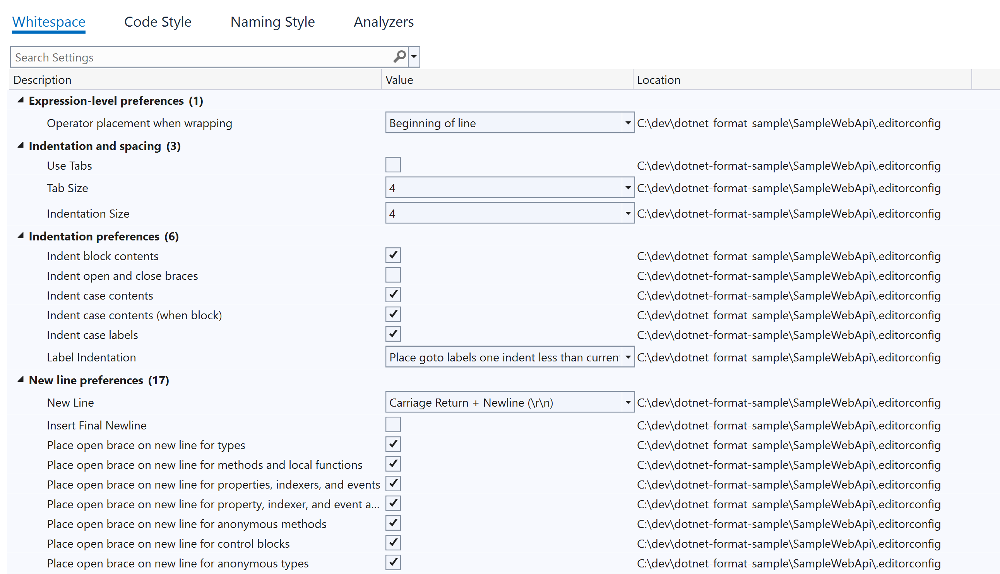
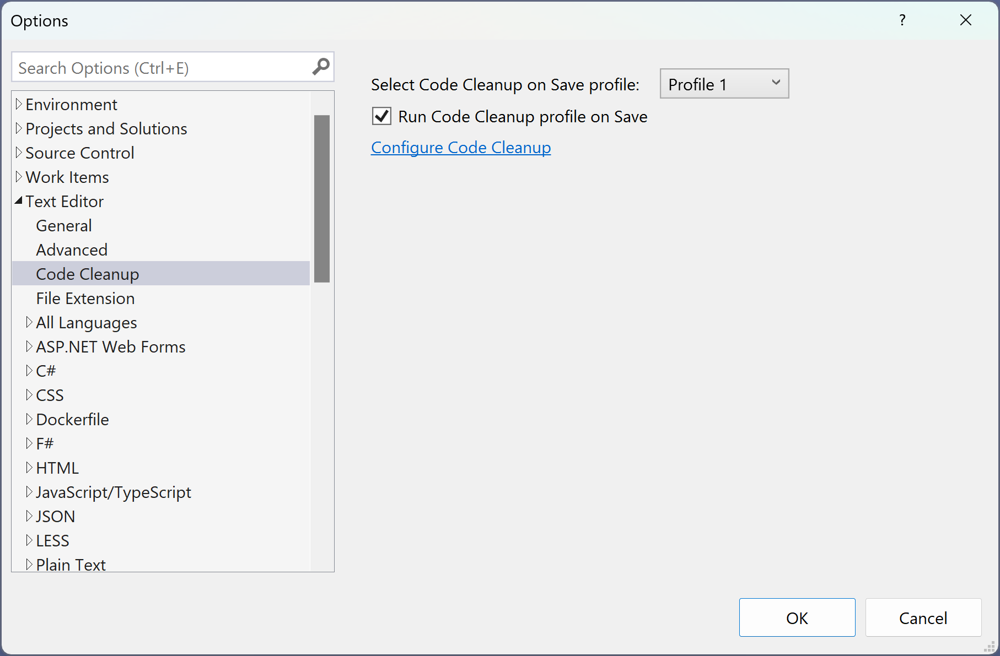
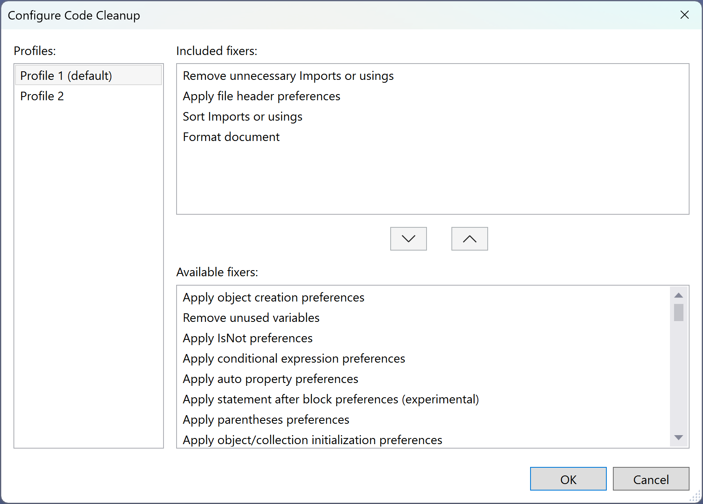
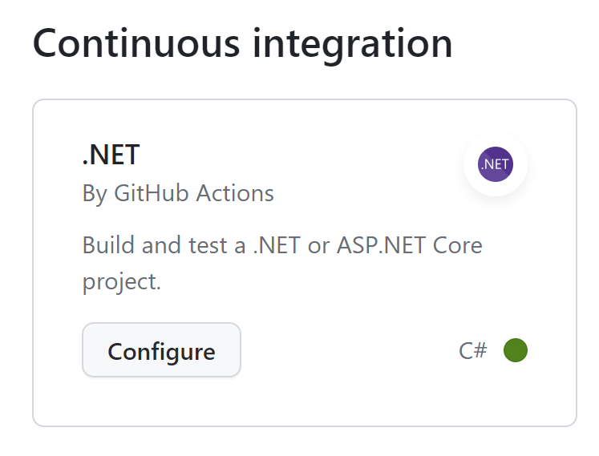

# How to enforce .NET format using EditorConfig and GitHub Actions

---

**Principal author**: [Xiaodi Yan](https://learn.microsoft.com/users/yanxiaodi/)

---

Coding style is a personal preference. However, it is important to have a consistent coding style across the team. Automating the code formatting process can help us reduce the time spent on code reviews and improve the code quality. In this how-to article, you will learn how to enforce your .NET code formatting using EditorConfig and GitHub Actions.

We will look into:

* How to create an EditorConfig file
* How to format your code locally
* How to config GitHub Actions to check the code formatting

<!-- 3. Prerequisites --------------------------------------------------------------------

Optional: If there are prerequisites for the task covered by the how-to guide, make 
**Prerequisites** your first H2 in the guide. The prerequisites H2 is never numbered.
Use clear and unambiguous language and use a unordered list format.
If there are specific versions of software a user needs, call out those versions (for example: 
Visual Studio 2019 or later).

-->

## Prerequisites

To complete this how-to guide, you should have the following prerequisites installed and configured:

* [.NET 6 SDK or later](https://dotnet.microsoft.com/download?WT.mc_id=DT-MVP-5001643)
* [Visual Studio 2022](https://visualstudio.microsoft.com/?WT.mc_id=DT-MVP-5001643)
* A .NET project in [GitHub repository](https://github.com/)

## 1 - Creating an EditorConfig file

An EditorConfig file defines and maintains consistent coding styles regardless of which editor or IDE you use. It is a text file that contains a collection of settings that define how to format code. EditorConfig supports various programming languages and IDEs. Defining an EditorConfig file in the code repository can help us enforce the coding style for developers working on the same project.

For more information about EditorConfig, see [EditorConfig](https://editorconfig.org/).

To create an EditorConfig file, you have a few options:

### Option 1: Creating an EditorConfig file in Options dialog

1. Open your .NET project/solution in Visual Studio 2022. Click **Tools** > **Options** > **Text Editor** > **C#** > **Code Style** > **General**. Then click **Generate .editorconfig file from settings**.

   

2. Choose the root directory of your project/solution and name the file `.editorconfig`. Click **Save**.

### Option 2: Creating an EditorConfig file in Solution Explorer

1. Open your .NET project/solution in Visual Studio 2022. Right-click the project/solution in **Solution Explorer** and click **Add** > **New Item**.

2. In the search box, type `editorconfig`. You will see two templates as follows:

   

3. Select the **èditorconfig File (.NET)** template and rename it to `.editorconfig`. Click **Add**. This will create an EditorConfig file in the root directory of your project/solution with [default .NET code style settings](https://learn.microsoft.com/dotnet/fundamentals/code-analysis/code-style-rule-options?WT.mc_id=DT-MVP-5001643).

### Option 3: Creating an EditorConfig file using the dotnet CLI

1. Open a command prompt and navigate to the root directory of your project/solution.
2. Run the following command to create an EditorConfig file:

   ```bash
   dotnet new editorconfig
   ```

   This will create an EditorConfig file in the root directory of your project/solution with [default .NET code style settings](https://learn.microsoft.com/dotnet/fundamentals/code-analysis/code-style-rule-options?WT.mc_id=DT-MVP-5001643).

> [!NOTE]
> The `.editorconfig` file will be applied to all the files in the same directory and its subdirectories. You can override the settings in a subdirectory by creating another `.editorconfig` file in that subdirectory. However, it is recommended to have only one `.editorconfig` file in the root directory of your project/solution to avoid confusion unless you have a good reason to do so.

## 2 - Editing the EditorConfig file

You can edit the `.editorconfig` file in Visual Studio 2022 or any text editor. It is recommended to use Visual Studio 2022 to edit the file as it provides a better user experience.

1. Open the `.editorconfig` file in Visual Studio 2022. You can see the default settings for the code style.

   

2. Edit the code style settings as needed. Note that different teams may have different code style settings. Discuss with your team members and agree on a set of code style settings before editing the file.

## 3 - Formatting your code locally

You have a couple of options to format your code locally.

### Enforcing code style on save

1. Click **Tools** > **Options** > **Text Editor** > **Code Cleanup** in Visual Studio 2022. Select the **Run Code Cleanup profile on Save** checkbox.

   

2. Click **Configure Code Cleanup**. You can choose what fixes to run on save. Click **OK**.

   

3. Open a C# file in your project/solution. Make some changes to the code and save the file. The code will be formatted automatically. You can also press `Ctrl + K, Ctrl + E` to format the code manually.

### Enforcing code style on build

Open the `.csproj` file of your project/solution in Visual Studio 2022. Add the following code to the file:

```xml
<PropertyGroup>
  <EnforceCodeStyleInBuild>true</EnforceCodeStyleInBuild>
</PropertyGroup>
```

This setting enables code style enforcement on build. Any code style violations will be reported as build warnings or errors according to the `.editorconfig` file.

### Enforcing code style using dotnet format command

You can also manually run the `dotnet format` command to format your code. Here are some examples:

* Format all the .NET code files in the root directory of your project/solution and its subdirectories:

   ```bash
   dotnet format
   ```

* Verify the code formatting without making any changes:

   ```bash
   dotnet format --verify-no-changes
   ```

* Specify the path to the project/solution file when formatting the code:

   ```bash
   dotnet format ./SampleWebApi/SampleWebApi.sln
   ```

* Report detailed information:

   ```bash
   dotnet format --verbosity diagnostic
   ```

You can find more information about the `dotnet format` command [here](https://learn.microsoft.com/dotnet/core/tools/dotnet-format?WT.mc_id=DT-MVP-5001643).

## 4 - Configuring GitHub Actions to check the code formatting

GitHub Actions is a CI/CD tool that allows you to automate your software development workflows. You can use GitHub Actions to check the code formatting in your pull requests. This can help us ensure that all the code changes are formatted correctly before merging to the main branch.

1. Go to your GitHub repository of the .NET project. Click **Actions**.

2. In the **Continuous integration** category, click **Configure** for **.NET**.

   

3. Rename the workflow name as `dotnet-format.yml` or any name you like.

4. Edit the YAML file as follows. Please update the content per your project/solution. You may need to update the SDK version and the path to the project/solution file.

   ```yaml
   name: .NET format
   
   on:
     push:
       branches: [ "main" ]
     pull_request:
       branches: [ "main" ]
   
   jobs:
     dotnet-format:
   
       runs-on: ubuntu-latest
   
       steps:
       - uses: actions/checkout@v3
       - name: Setup .NET
         uses: actions/setup-dotnet@v3
         with:
           dotnet-version: 8.0.x
       - name: Restore dependencies
         run: dotnet restore
       - name: Format
         run: dotnet format --verify-no-changes --verbosity diagnostic
   ```

   In the YAML file, we added a job called `dotnet-format` that checks the code formatting. The command `dotnet format --verify-no-changes --verbosity diagnostic` will check the code formatting and report any violations. If there are any violations, the workflow will fail and the pull request will not be merged to the main branch.

5. Click **Commit changes** to save the changes. If your main branch is protected, you will need to create a pull request and merge it to the main branch.

6. Check the status of the workflow when a pull request is created. Click **Details** to see the details of the workflow.

   

## Next steps

In this how-to article, you learned how to enforce your .NET code formatting using EditorConfig and GitHub Actions. To learn more about .NET code styles, please check out the following resources:

* [.NET Code style preferences](https://learn.microsoft.com/visualstudio/ide/code-styles-and-code-cleanup?WT.mc_id=DT-MVP-5001643)
* [Create portable, custom editor settings with EditorConfig](https://learn.microsoft.com/visualstudio/ide/create-portable-custom-editor-options?WT.mc_id=DT-MVP-5001643)
* [.NET Code-style rule options](https://learn.microsoft.com/dotnet/fundamentals/code-analysis/code-style-rule-options?WT.mc_id=DT-MVP-5001643)
* [.NET Code-style rules](https://learn.microsoft.com/dotnet/fundamentals/code-analysis/style-rules?WT.mc_id=DT-MVP-5001643)
* [Overview of .NET source code analysis](https://learn.microsoft.com/dotnet/fundamentals/code-analysis/overview?WT.mc_id=DT-MVP-5001643)
* [GitHub Actions documentation](https://docs.github.com/actions)

If you use Azure DevOps Pipelines, you can implement the same workflow using Azure DevOps Pipelines. For more information, see [Build, test, and deploy .NET Core apps using Azure DevOps Pipelines](https://docs.microsoft.com/azure/devops/pipelines/languages/dotnet-core?WT.mc_id=DT-MVP-5001643).
