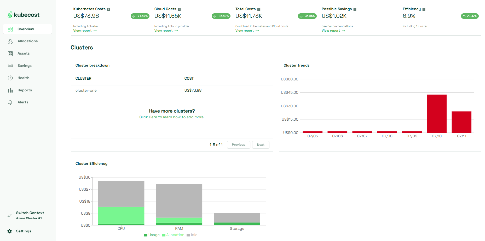
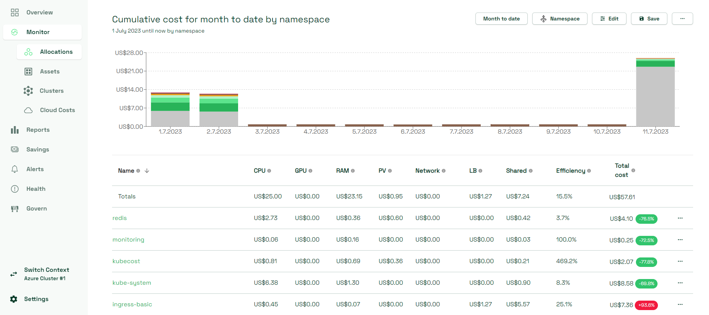
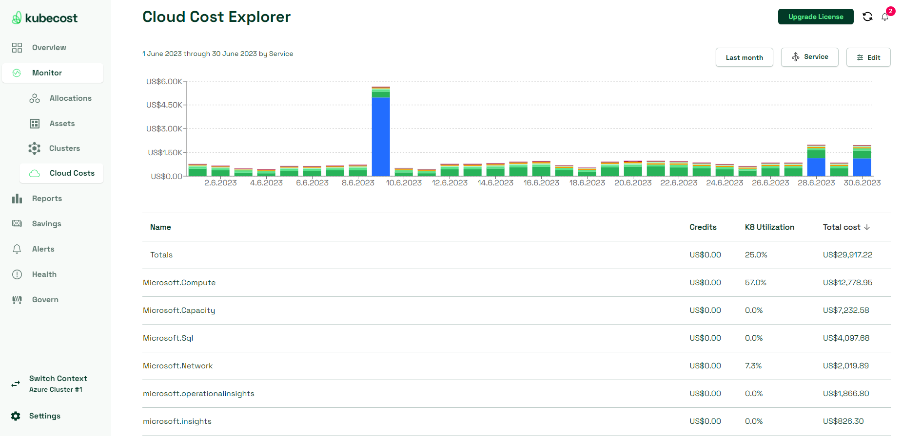
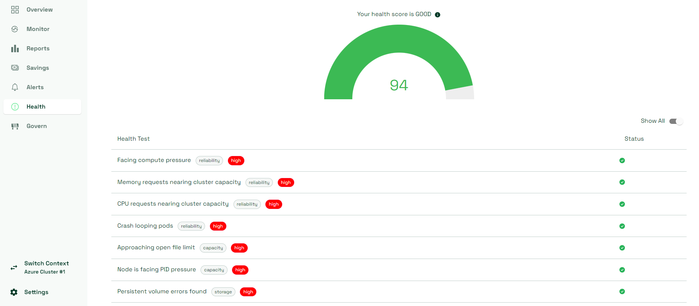

# Manage cost and optimize resources in AKS with Kubecost

---

**Principal author**: [Kristina Devochko](https://learn.microsoft.com/users/kristinadevochko-7890)

---

Cost management and resource optimization are crucial aspects of operating Kubernetes, including managed Kubernetes service offerings like Azure Kubernetes Service (AKS). In this article, we explore Kubecost community version, which is an open-core tool that can help managing costs and utilizing resources more efficiently within AKS clusters.

We will look into:

- How Kubecost community version can be installed and configured in an AKS cluster;
- How Kubecost dashboard can be publicly exposed over HTTPS and secured with Microsoft Entra ID authentication with help of OAuth2 Proxy;
- How Azure-related out-of-cluster costs can be integrated into the same Kubecost dashboard with help of Azure Cloud Integration;

Finally we will briefly touch upon core capabilities of Kubecost community version like cluster cost trends, resource utilization insights, and cluster improvement recommendations.

## Prerequisites

- Helm CLI (version 3.1+)

- Azure CLI

- PowerShell

- Existing AKS cluster

- (Optional) **Publicly accessible Kubecost dashboard:** Ingress Controller must be installed on AKS in order to enable public access to Kubecost dashboard. There are multiple types of Ingress Controllers that you can use in AKS. In this article we will be using Application Gateway Ingress Controller (AGIC) add-on for AKS. Installation of Ingress Controller is beyond the scope of this article, but you can follow this tutorial to install AGIC add-on on a new or existing AKS cluster: [Tutorial: Enable application gateway ingress controller add-on for an existing AKS cluster with an existing application gateway](https://learn.microsoft.com/azure/application-gateway/tutorial-ingress-controller-add-on-existing?toc=https%3A%2F%2Flearn.microsoft.com%2Fen-us%2Fazure%2Faks%2Ftoc.json&bc=https%3A%2F%2Flearn.microsoft.com%2Fen-us%2Fazure%2Fbread%2Ftoc.json)

- (Optional) **Publicly accessible Kubecost dashboard:** custom domain that you will publicly expose a Kubecost dashboard at and provision a TLS certificate for. Acquiring and hosting a custom domain is beyond the scope of this article, but you can follow this Microsoft Learn module to learn more about hosting your custom domain with Azure DNS: [Host your domain on Azure DNS](https://learn.microsoft.com/training/modules/host-domain-azure-dns)

- (Optional) **Publicly accessible Kubecost dashboard:** certificate authority (CA) for TLS certificate provisioning. Certificate management tools like `cert-manager` will query the CA to request TLS certificates. Acquiring TLS certificates is beyond the scope of this article. In this article we will be using [Let's Encrypt](https://letsencrypt.org/docs), which is a popular, good and free CA option.

- (Optional) **Publicly accessible Kubecost dashboard:** Certificate management tool for AKS cluster to automatically provision TLS certificates for secure connection to Kubecost dashboard. Installing and configuring certificate management tool is beyond the scope of this article. In this article we will be using [cert-manager](https://cert-manager.io/docs/installation), which is a popular, good and open source certificate management alternative.

## 1 - Create namespace for Kubecost resources

First you need to create a namespace in an AKS cluster where Kubecost resources will be deployed. Default and recommended name for the namespace is `kubecost`, and it will be the one we will be using in this article.

**Please ensure that active Kubernetes context is set to the correct AKS cluster prior to executing below command.** You can verify this by executing following command in `kubectl`: `kubectl config current-context`.

``` powershell
kubectl create namespace kubecost
```

## 2 - Configure Azure Cloud Integration for Kubecost

In this step you will configure Azure Cloud Integration. It enables overview of daily costs for the Azure subscription where AKS cluster is deployed, as part of the Kubecost dashboard. This will allow you to see out-of-cluster costs for other Azure services side-by-side with in-cluster costs in the same dashboard.

In order to configure Azure Cloud Integration you will need to set up daily export of Azure cost reports to a dedicated Azure storage account. Kubecost will access Azure storage account via API to retrieve the cost data for display in the dashboard.

> [!NOTE]
> Not all Microsoft Azure offers are currently supported in Cost Management. Please ensure that your Azure subscription type is supported by Cost Management prior to setting up Azure cost daily export. You may find supported Azure offers here: [Supported Microsoft Azure offers](https://learn.microsoft.com/azure/cost-management-billing/costs/understand-cost-mgt-data#supported-microsoft-azure-offers).

**Please ensure that the correct Azure subscription is set as active prior to executing below commands.** You can verify this by executing following command in Azure CLI: `az account show`. You can set an Azure subscription to active by executing following command in Azure CLI: `az account set --subscription <AzureSubscriptionId>`

``` powershell
# Declare required configuration values
$subscriptionId = (az account show | ConvertFrom-Json).id

# Resource group name must be unique on the subscription level, so please ensure that there is no existing resource group with the name that you're planning to use
$resourceGroup = "kubecost-rg"
$location = "northeurope"

# Storage account name must be globally unique so please ensure that the name you're using is unique, otherwise you may get duplicate errors upon storage account creation
$storageAccount = "kubecostst" 
$storageContainer = "costreports"
$storageContainerPath = "costreportsdir"

# In order to enable cost report export we need to configure the recurrence period. Below variables configure the export to start in one day and run for 50 years (we can't omit the to-date), but you're welcome to modify it as per your needs
$fromDate = (Get-Date).AddDays(1).ToString("yyyy-MM-ddTHH:mm:ss")
$toDate = (Get-Date).AddYears(50).ToString("yyyy-MM-ddTHH:mm:ss")

# Register service provider to create cost reports
az provider register --namespace 'Microsoft.CostManagementExports'

# Create new resource group where Kubecost resources will be located
az group create --name $resourceGroup --location $location

# Create new storage account where Azure cost reports will be located
az storage account create --resource-group $resourceGroup --name $storageAccount --location $location --kind StorageV2 --sku Standard_LRS

# Create container in the newly created storage to store cost reports
az storage container create --name $storageContainer --account-name $storageAccount

# Create daily Azure cost exports to the newly created storage
az costmanagement export create --name kubecostexport --type AmortizedCost `
--scope "subscriptions/$subscriptionId" `
--storage-account-id "/subscriptions/$subscriptionId/resourceGroups/$resourceGroup/providers/Microsoft.Storage/storageAccounts/$storageAccount" `
--storage-container $storageContainer --timeframe MonthToDate --recurrence Daily `
--schedule-status Active --storage-directory $storageContainerPath --recurrence-period from="$fromDate" to="$toDate"

# Get access key for the newly created Azure storage account
$storageAccessKey = (az storage account keys list --resource-group $resourceGroup --account-name $storageAccount | ConvertFrom-Json) | Select-Object -First 1 -ExpandProperty value
```

Now that the daily export of Azure cost reports is set up you will need to save some of its configuration information as a JSON file named `cloud-integration.json`. This file will be used to create a Kubernetes Secret in the next step.

> [!NOTE]
> `cloud-integration.json` must be saved in UTF-8 without BOM encoding. This may be a challenge if you're using PowerShell version **5.x** for running below commands, since it uses UTF-8 BOM encoding by default. A workaround in this case may be either to use PowerShell version 7+, create the `cloud-integration.json` file manually instead of doing it via below commands, or create the `cloud-integration.json` file with below commands but update its encoding manually afterwards. You can also use a .NET library to modify default encoding as part of PowerShell codeit's, but it is beyond the scope of this article (there's a [StackOverflow thread](https://stackoverflow.com/questions/5596982/using-powershell-to-write-a-file-in-utf-8-without-the-bom) that may be of help).

``` powershell
# Get temporary file path to save the JSON file to
$tempFilePath = [System.IO.Path]::GetTempPath()

# Create JSON object that will store Azure Cloud Integration configuration - it will populate values from the variables that we've defined above
$cloudIntegrationObject = @"
{
  "azure": [
    {
        "azureSubscriptionID": "$subscriptionId",
        "azureStorageAccount": "$storageAccount",
        "azureStorageAccessKey": "$storageAccessKey",
        "azureStorageContainer": "$storageContainer",
        "azureContainerPath": "$storageContainerPath",
        "azureCloud": "public"
    }
  ]
}
"@

# Save JSON object as a file with the required name
$cloudIntegrationObject | Set-Content "$tempFilePath/cloud-integration.json" -Encoding UTF8
```

## 3 - Create Kubernetes Secret for Azure Cloud Integration configuration

Now that Azure Cloud Integration is configured we can deploy `cloud-integration.json` file, which we created in the previous step, as a Kubernetes Secret in the respective AKS cluster and in the same namespace where the rest of Kubecost resources will be deployed. Kubecost will use this Secret to identify which Azure storage it needs to query in order to retrieve daily Azure cost report data.

``` powershell
kubectl create secret generic kubecostazstorage --from-file "$tempFilePath/cloud-integration.json" --namespace kubecost
```

## 4 - Deploy Kubecost

You are ready to deploy Kubecost Helm chart with enabled Azure Cloud Integration to an AKS cluster! As you can see below, in the `helm upgrade` command we're configuring Azure Cloud Integration for Kubecost by setting the name of the Kubernetes Secret, that we created in the previous step, as the `kubecostProductConfigs.cloudIntegrationSecret` parameter value.

Please note that usage of a latest/wildcard version for a Helm chart deployment is not recommended. At the point of writing this article the latest stable version of Kubecost Helm chart is `1.105.0`. You can find stable release version with help of following command: `helm search repo kubecost/cost-analyzer`.

Prior to running below commands, please update `KubecostHelmChartVersion` placeholder with the Kubecost Helm chart version of your choice.

``` powershell
# Add Kubecost Helm repository and get latest repository updates
helm repo add kubecost https://kubecost.github.io/cost-analyzer
helm repo update

# Deploy Kubecost Helm chart with enabled Azure Cloud Integration
helm upgrade kubecost kubecost/cost-analyzer --install --namespace kubecost --set kubecostProductConfigs.cloudIntegrationSecret=kubecostazstorage --version <KubecostHelmChartVersion>
```

Once Helm deployment is finished and all Pods are in the Running state you can access Kubecost dashboard. Since we haven't exposed Kubecost dashboard for public access, it can currently be accessed only at `http://localhost:9090` with help of `kubectl port-forward` command: `kubectl port-forward -n kubecost deployment/kubecost-cost-analyzer 9090`.

In a real-life scenario you may want others to be able to access Kubecost dashboard without depending on `kubectl` or direct access to the cluster. At the same time you would still want this access to be secure and limited by some form of authentication in order to prevent full public exposure of this type of data.

Single Sign-On (SSO) and Role-based access control(RBAC) functionality are unfortunately only supported in Kubecost enterprise version, but it's still possible to achieve the same type of functionality by implementing TLS and Microsoft Entra ID authentication to Kubecost dashboard with help of another open source tool - OAuth2 Proxy. Below steps will demonstrate how you can do that.

**Please ensure that you have optional pre-requisites in place prior to following next steps.**

## 5 - (Optional) Create OAuth2 Proxy application in Microsoft Entra ID

Installation and configuration of Ingress Controller and TLS certificate management for an AKS cluster are outside of the scope of this article. This article will be using Application Gateway Ingress Controller, Let's Encrypt and cert-manager. You can check both [pre-requisites](#prerequisites) and [next steps](#next-steps) section for additional information on how to install and configure these resources.

In this step we need to register an application in Microsoft Entra ID tenant that will represent OAuth2 Proxy instance for Kubecost.

Prior to running below commands, please update `KubecostHostname` placeholder with the hostname that you would like to expose Kubecost dashboard at. For example, `kubecost.mycustomdomain.com`.

``` powershell
# Create application registration in Microsoft Entra ID with reply URL that represents OAuth2 Proxy authentication URL for the respective Kubecost instance
$proxyClientId = (az ad app create --display-name "kubecost-oauth2-proxy" --sign-in-audience AzureADMyOrg --web-redirect-uris "https://<KubecostHostname>/oauth2/callback" | ConvertFrom-Json) | Select-Object -First 1 -ExpandProperty appId

# Create client secret for the application: you can either create it manually in Azure portal or use below command to generate a client secret automatically
$proxyClientSecret = $(az ad app credential reset --id $proxyClientId --append --display-name "kubecost-client-secret" --query password --output tsv)
```

You should now be able to locate OAuth2 Proxy application in App registrations view in Azure portal:


## 6 - (Optional) Add DNS record for Kubecost

In order to make Kubecost dashboard accessible publicly you need to add a DNS record for the chosen fully qualified domain name (FQDN) pointing to the respective public IP that the Kubecost dashboard instance will be exposed at. If your custom domain is not hosted in Azure DNS you will need to reference instructions for the respective hosting provider on how to add a new DNS record.

If your custom domain is hosted in Azure DNS you can use below Azure CLI command to add a new DNS record with respective public IP. In this article the DNS record for Kubecost dashboard is mapped to the public IP of Application Gateway Ingress Controller.

**Prior to running below commands, please ensure that you've updated placeholders according to how your Azure DNS zone is set up.**

``` powershell
az network dns record-set a add-record --resource-group <ResourceGroupName> --zone-name <AzureDNSZoneName> --record-set-name kubecost  --ipv4-address <PublicIPAddress>
```

## 7 - (Optional) Deploy OAuth2 Proxy

In this step you will deploy OAuth2 Proxy Helm chart that will enable Microsoft Entra ID authentication for the Kubecost dashboard, which you deployed in [step 4](#4---deploy-kubecost). Please note that the same namespace is used for OAuth2 Proxy and Kubecost deployments.

First you will need to create a `values.yaml` file which will contain deployment configuration that OAuth2 Proxy will use in order to properly enable Microsoft Entra ID authentication for Kubecost. All possible configuration properties are available in the official [OAuth2 Proxy Helm chart repository](https://github.com/oauth2-proxy/manifests/blob/main/helm/oauth2-proxy/values.yaml). We will keep configuration to the minimum in this article.

You will need to replace following placeholders:

- **KubecostHostname**: FQDN that Kubecost dashboard will be exposed at, for example ***kubecost.mycustomdomain.com***;
- **ProxyAppClientId**: client id for OAuth2 Proxy app registered in Microsoft Entra ID;
- **ProxyAppClientSecret**: client secret for OAuth2 Proxy app registered in Microsoft Entra ID;
- **ProxyAppTenantId**: Microsoft Entra ID Tenant ID where OAuth2 Proxy app is registered;
- **CookieSecret**: a secret value of your choice that OAuth2 Proxy will use to encrypt/decrypt user session cookies. Please note that cookie secret must be 16, 24, or 32 bytes to create an AES cipher. You can generate a random value with `openssl` command: `openssl rand -base64 32 | head -c 32 | base64`;

Once the placeholders are updated in the below YAML code you may save it to a directory of your choice.

``` yaml
# values.yaml
ingress:
  enabled: true
  hosts:
    - <KubecostHostname>
  annotations:
    kubernetes.io/ingress.class: azure/application-gateway # required for Azure Application Gateway Ingress Controller
    appgw.ingress.kubernetes.io/ssl-redirect: "true"
    cert-manager.io/cluster-issuer: letsencrypt-prod # cert-manager ClusterIssuer for issuing TLS certificates
  tls:
    - secretName: kubecost-oauth2-proxy-ingress-tls-secret
      hosts:
        - <KubecostHostname>
proxyVarsAsSecrets: true # Use secrets instead of environment values for setting up OAuth2 Proxy variables
config:
  cookieName: kubecostproxycookie
  clientID: <ProxyAppClientId>
  clientSecret: <ProxyAppClientSecret>
  cookieSecret: <CookieSecret> # Cookie secret must be 16, 24, or 32 bytes to create an AES cipher.
  configFile: |-
        email_domains = [ "*" ]
        upstreams = [ "http://kubecost-cost-analyzer.kubecost.svc.cluster.local:9090" ]
        azure_tenant = "<ProxyAppTenantId>"
        oidc_issuer_url = "https://login.microsoftonline.com/<ProxyAppTenantId>/v2.0"
        provider = "oidc"
        skip_provider_button = "true"
podLabels:
  application: kubecost-oauth2-proxy
customLabels:
  application: kubecost-oauth2-proxy
replicaCount: 1
```

Once configuration is saved to `values.yaml`, you can deploy OAuth2 Proxy. Please remember to replace `PathToValuesFile` placeholder with the file path where you save the file.

``` powershell
# Add OAuth2 Proxy Helm repository and get latest repository updates
helm repo add oauth2-proxy https://oauth2-proxy.github.io/manifests
helm repo update

# Deploy OAuth2 Proxy Helm chart to kubecost namespace with the configuration value that we created above
helm upgrade --install kubecost-oauth2-proxy --namespace kubecost -f "<PathToValuesFile>/values.yaml" oauth2-proxy/oauth2-proxy
```

## 8 - (Optional) Deploy Kubecost Ingress

In the last step you will deploy Kubecost Ingress that will enable public access to the Kubecost dashboard.

``` yaml
# ingress.yaml
apiVersion: networking.k8s.io/v1
kind: Ingress
metadata:
  name: kubecost-cost-analyzer
  namespace: kubecost
  annotations:
    kubernetes.io/ingress.class: azure/application-gateway # required for Azure Application Gateway Ingress Controller
    appgw.ingress.kubernetes.io/backend-path-prefix: "/"
    appgw.ingress.kubernetes.io/ssl-redirect: "true"
    meta.helm.sh/release-name: kubecost # include Ingress to Kubecost Helm release
    meta.helm.sh/release-namespace: kubecost # include Ingress to Kubecost Helm release namespace
  labels:
    app: cost-analyzer
    app.kubernetes.io/instance: kubecost
    app.kubernetes.io/managed-by: Helm # include Ingress to Kubecost Helm deployment
    app.kubernetes.io/name: cost-analyzer
spec:
  tls:
  - hosts:
    - <KubecostHostname>
    secretName: kubecost-secret-name
  rules:
  - host: <KubecostHostname>
    http:
      paths:
      - path: /
        pathType: Prefix
        backend:
          service:
            name: kubecost-cost-analyzer
            port:
              number: 9090
```

Please remember to replace `PathToValuesFile` placeholder with the file path where you saved the file.

``` powershell
# Deploy Kubecost Ingress
kubectl apply -f "<PathToIngressFile>/ingress.yaml" --namespace kubecost
```

You can now access your Kubecost dashboard at a public URL that you've configured! Once you attempt to access the dashboard you should be first redirected to the login page, thanks to OAuth2 Proxy.

## Functional highlights

Now that you've successfully deployed Kubecost dashboard it's worth highlighting some of its functionality that can provide you with some useful information about cost and efficiency of your AKS clusters.

1. **Overview** provides useful insights into not only the overall cloud costs and cluster-specific costs, but also into how efficiently the cluster is utilized. For example, you can analyze the daily trend of how much RAM, CPU and storage stay idle and how much of these resources are allocated vs. how much are actually being used daily. This information may give you a better overview so that you can adjust the amount of requested resources to what you actually need, which is both a more cost-efficient and sustainable choice.



1. **Cost allocations by resource and overall cloud costs history** views provide daily overview of the cost per Kubernetes object like Namespace or Service, or per Azure service if you have enabled Azure Cloud Integration. This data can help you monitor if any resources suddenly get cost spikes in case of performance issues for example, or if there are resources that are not used anymore and can therefore be cleaned up.





1. **Cluster health tests** view evaluates the overall health of a Kubernetes/AKS cluster based on a collection of tests that it runs towards it. This data can be an additional helper in monitoring how your cluster and its workloads are doing.



1. **Cost saving recommendations** view provides a collection of useful recommendations that you can follow in order to reduce the overall cost of your cluster(s), as well as utilize its resources more efficiently and sustainably. Some of the recommendations may be to use reserved or spot instances, clean up zombie workloads or choose a different Node size. As you can see in the below screenshot, in case of right-sizing, Kubecost may even come with potentially better configuration or resource options, based on the usage and efficiency history that it gathers over time. This data can be helpful for you to take more informed choices for cluster configuration optimizations.


Finally, apart from SSO and RBAC support, Kubecost community version has a few other limitations that is worth knowing about:

- Kubecost community version supports displaying only one Kubernetes/AKS cluster per dashboard. A workaround here may be to use a single place or page where you can gather links to the Kubecost dashboards that are deployed in different clusters, so that those can be accessed from a single place.

- Kubecost community version supports data retention for 15 days.

## Next steps

To learn more about Kubecost, as well as how OAuth 2.0 authentication with OAuth2 Proxy works in more detail, please check out following resources:

- [Kubecost documentation](https://docs.kubecost.com/install-and-configure/install/getting-started)
- [OAuth2 Proxy documentation](https://oauth2-proxy.github.io/oauth2-proxy/docs)
- [Blog post: Setting Up OAuth 2.0 Authentication for Applications in AKS With NGINX and OAuth2 Proxy](https://kristhecodingunicorn.com/post/k8s_nginx_oauth)
