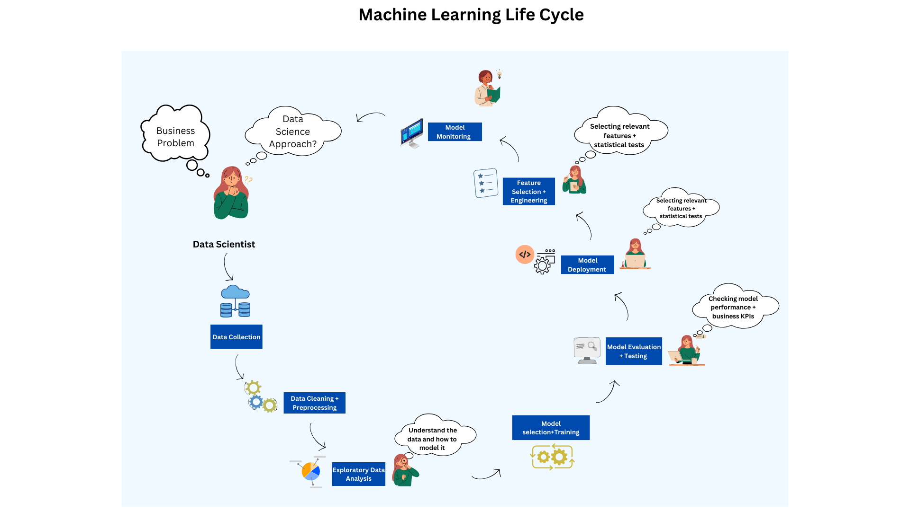
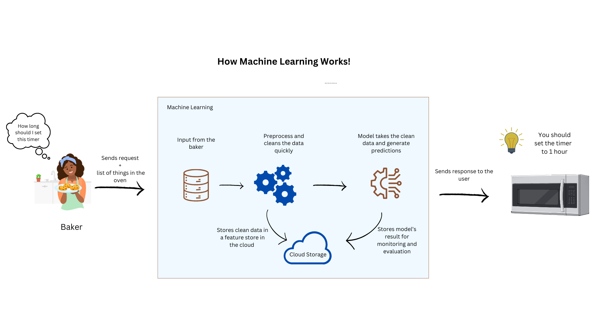

# Machine Learning for those who don't know anything about Machine Learning

---

**Principal author**: [Bunmi Akinremi](/users/bunmiakinremi-3492/)

---

From the beeping sound of your alarm clock, trying to get you out of bed, to the smell of burnt chicken in the oven because you set the timer wrong, machines have been crucial to helping us with our daily task. If the oven was smart enough to know that the chicken was already cooked, that'll be cool, isn't it? 
 
Machines are all around us! From rather subtle ones like your mobile phones to big loud ones like the caterpillar used for drilling. I’m not going to go deep into machine education, but I have an interesting concept to introduce to you.
 
## What is Machine Learning?
 
First thing’s first, Machine Learning is not Artificial intelligence (AI). It is a field in AI with a focus on developing algorithms and statistical models that makes machines do magic (perform tasks without explicitly telling them to). AI includes many fields and Machine Learning is only one part of it. 
 
Now, just like AI, Machine learning has its own sub fields. It used to be three, but now, let’s just say six.
 
- Supervised learning: This is simply training a model by giving it past examples of the task you want it to do. For example, training a model to differentiate between chicken and fish. This kind of task is called classification, where the target is either one thing or the other. In cases where you have to predict numbers like prices, time, and so on, it's called regression. Our baking scenario is a regression task.
- Unsupervised learning: This is when you do not provide the model with any sample of what you want to do, and it tries to figure out how to classify the data by itself. 
- Reinforcement Learning: This is a more complex scenario where you have an agent guided by a policy and it gets rewarded or punished if it passes or fails a task.
 
The other types are:
- Deep learning
- Transfer learning
- Generative models
 
Say you were able to build a software that automatically switches off the oven when your chicken has been there for a specific time at a specific temperature. Suppose you started taking baking classes, and the thought of having to write different algorithms for each pastry you might bake is just exhausting. Well, that’s where machine learning comes in. 
 
It gives you the ability to train one algorithm to adapt to the different types of pastries or meals you might need to use the oven for. You only need to provide specific examples of meals, temperature and the time it usually takes, and it’ll figure out the rest.

## How Machine Learning actually works

Machine Learning, like any other software is remote and abstract until there's an interface to communicate with it. Just like the concept of a website, you need to have a front-end interface before you can buy or sell items online. The machine learning algorithm that gives you a result when you send a query is called a model. 

Before you can start making magic with machine learning, you need to first follow the machine learning process. 
- Data collection: where you get information on the various pastries you'll like to bake and the time it takes to bake them. You can store them in a CSV file.
- Data cleaning and processing: This is where you remove inconsistencies like kg, kilogramme, all referring to a unit of measurement. This is where you would convert things like ingredients to numbers, as your machine can't understand text. You can also convert all the time to hours or minutes, or seconds. 
- Data visualisation and exploration: Here, you are more concerned about understanding your data, and finding possible bias or hidden information. You can also perform various statistics to understand your data.
- Feature engineering: This is where you try select only the relevant features or create new features.
- Modelling: Here's the meat, you can choose one of the many algorithms and train it with your data. Logistics regression is usually a good start.
- Evaluation: Now that you have your model, how do you test and measure its accuracy? There are several metrics you can use, but for classification, accuracy is a good start for simple tasks.
- Deployment: once you are satisfied with the results, you can decide to build a mobile app or website for it. Or you can even embed it directly in your oven, using embedded systems.
 
When a user sends a query, depending on where the model is hosted (on device or in the cloud), it passes through some type of processing before the machine learning algorithm receives it. This pre-processing may include data type conversion and transforming relevant features. It moves this prepared data to the model for making predictions. This is also called inference. 
 
## Real World Machine Learning Use case
 
You don’t have to search too far to find a use case. 
 
- Your phone - Siri/Google Assistant
- How does Amazon know that you’ll like this shoe or this dress? Through recommendations by machine learning models.
- Customer chatbot that responds to queries even at midnight.
- Netflix movie recommendation
- Tailored Advertisment. Google, Facebook, and other advertising platforms use it to recommend ads that you'll most likely click.
- Forecasting. Whether you're predicting stock prices, what team would win the next match, or whether someone would repay your loan soon, machine learning works well in these scenarios.
 
## Common Misconceptions
- Machine Learning can do anything and can be applied to solve any problem.
- You need to be very good in mathematics and statistics to get started.
- Machine learning requires extensive coding skills.
- Machine Learning will take away all our jobs. No and yes. Yes because it'll take away redundant tasks, allowing you to focus on the most intresting part of your job. No because it will make your work easier and even create more jobs. 
- Machine Learning is always accurate.
- Machine Learning understands context like humans, it doesn't - it's not sentinet.
 
## Getting Started with Machine learning
 
Here are some great resources to help you get started.
 
- [Introduction to Machine Learning](https://youtu.be/IpGxLWOIZy4?si=8UrbZ4lAhLlF3VCW)
- [Getting started with Numpy and Pandas](https://medium.com/aiplusoau/getting-started-with-numpy-and-pandas-bc80de19536e)
- [Complete learning path from data processing to model deployment](/collections/k7zhwr43rm1wo)
