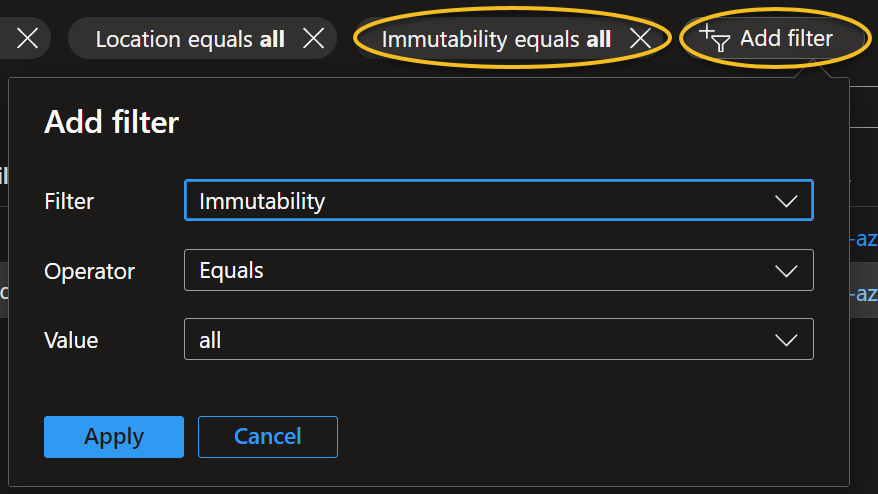
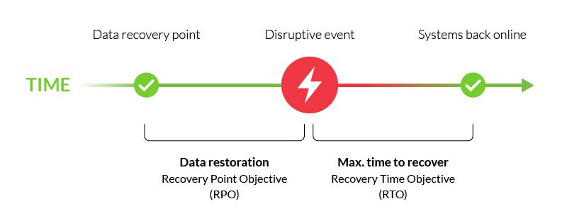

# Securing your Microsoft Azure Backups

---

**Principal author**: [Luke Murray](https://learn.microsoft.com/users/lukemurraynz/?WT.mc_id=AZ-MVP-5004796)

---

So, you have enabled your Azure Virtual Machine or Azure File Share backups using Azure Backup services and see your first Backup job run… great!

**Protecting your workloads and their backups doesn't stop there.**

Backups are vital to the continuity of your workloads, whether recovering from a malware attack, reverting recent changes as part of a Change Control, or storing your data for legal requirements – having backups of your data can be essential to the continued running of your services, so you want to protect them as much as possible.

Over the last few years, as security concerns have grown across a plethora of platforms and services, Microsoft Backup as a product hasn't stood still, with numerous features such as:

* [The transition of the Backup alerts](https://learn.microsoft.com/azure/backup/move-to-azure-monitor-alerts?WT.mc_id=AZ-MVP-5004796#supported-alerting-solutions) from Classic to Azure Monitor allows you to take advantage of action groups, email/SMS notifications, Azure Mobile app notifications and automation on failed backups or if someone deletes a backup job.
* Support for Azure Virtual Machines, running [Premium SSD v2](https://azure.microsoft.com/updates/premium-ssd-v2-backup-support/?WT.mc_id=AZ-MVP-5004796), with v2 Premium SSD offering the next level of storage performance early on.
* Azure Backup support for [Confidential Virtual Machines](https://learn.microsoft.com/azure/confidential-computing/overview?WT.mc_id=AZ-MVP-5004796) using Customer Managed Keys
* [SAP HANA system replication](https://learn.microsoft.com/azure/backup/sap-hana-database-with-hana-system-replication-backup?WT.mc_id=AZ-MVP-5004796) backup support on Azure Virtual Machines
* Greater visibility with [Azure Backup Reports](https://learn.microsoft.com/azure/backup/configure-reports?tabs=backup-vaults&WT.mc_id=AZ-MVP-5004796) lets you see your backup compliance visually.

This is just a list of SOME of the recent changes over the past few months at the time this article was written; as always, you can review the Azure updates page for the latest updates, but hopefully, this gives you a taste that the environment that is securing and storing your backups doesn't stand still.

So let us go on a journey to protect our backups from malicious attacks and ourselves!

Let's take a look at the following:

* Immutable vault
* Soft delete
* Resource Guard
* Enhanced policy
* Intelligent Tiering

## Immutable vault

First up is **immutability**.

> “While Azure Backup stores data in isolation from production workloads, it allows performing management operations to help you manage your backups, including those that allow you to delete recovery points. However, in certain scenarios, you may want to make the backup data immutable by preventing any such operations that, if used by malicious actors, could lead to the loss of backups. The Immutable vault setting on your vault enables you to block such operations to ensure that your backup data is protected, even if any malicious actors try to delete them to affect the recoverability of data.”

While Azure Backup stores data in isolation from production workloads, it allows you to perform management operations to help you manage your backups, including those that allow you to delete recovery points. You may want to make the backup data immutable by preventing any such operations that, if used by malicious actors, could lead to the loss of backups.

You can read more about immutable vaults and the statuses of Disabled/Enabled and Enabled and Lock directly at the [Microsoft Learn documentation](https://learn.microsoft.com/azure/backup/backup-azure-immutable-vault-concept?tabs=recovery-services-vault&WT.mc_id=AZ-MVP-5004796).

It’s worth making sure you don’t enable and lock your Recovery services vault unless you are certain of the backup job retention period, as this cannot be altered (reduced) after it is locked.

1. To enable an immutable vault, navigate to your **[Recovery Services vault](https://portal.azure.com/#view/HubsExtension/BrowseResource/resourceType/Microsoft.RecoveryServices%2Fvaults)**
2. Click **Properties**
3. Click **Immutable Vault**
4. Select '**Enable vault immutability**'
5. Click **Apply**

You can view the status of multiple Recovery Services vaults in the Azure Portal directly by using the portal filters.

## Soft Delete

While immutability can protect you from losing data indefinitely and making sure your data is protected from any tampering attempts, being able to restore recently deleted snapshots can help make sure that your recent snapshots can be restored, working well as an operational safeguard, with or without immutability.

Azure Backup *(Recovery Services Vaults and Backup Vaults)* contains enhanced soft delete functionality.

1. To enable Soft Delete, navigate to your **[Recovery Services vault](https://portal.azure.com/#view/HubsExtension/BrowseResource/resourceType/Microsoft.RecoveryServices%2Fvaults)**
2. Select **Properties**
3. Select **Security Settings**
4. Click **Update**
5. Select **Enable soft delete for Cloud workloads**.
6. Adjust **retention period** *(i.e., when the backup item can be restored, the minimum is 14 days to a maximum of 180 days)*.
7. Click **Update**

> Selecting Enable Always-on soft delete is a permanent setting to ensure that soft delete is always enabled and cannot be turned off for that particular Recovery Services or Backup Vault. To recover an item using soft delete, navigate to the backup item within your Recovery Services vault and select Undelete.

## Resource Guard

Resource Guard allows multi-user authorization *(MUA)* for Azure Backup operations. Examples where Multi-user authorization can be used, are adjusting the Azure backup policies or deleting backup jobs, forcing Resource Guard to prompt the administrator to make the changes for MFA *(Multifactor Authentication)*, and adding protection.

> "Ensure the Backup admin does not have Contributor permissions on the Resource Guard. You can choose to have the Resource Guard in another (such as a management subscription) of the same directory or another directory to ensure maximum isolation."

To function as intended, a different user must own the Resource Guard, and the vault admin must not have Contributor permissions.

Refer to: [Usage scenarios](https://learn.microsoft.com/azure/backup/multi-user-authorization-concept?tabs=recovery-services-vault&WT.mc_id=AZ-MVP-5004796#usage-scenarios), for various options, but essentially isolation is key.

1. To create a **Resource Guard**, navigate to **Resource Guards** in the Azure Portal
2. Click **Create Resource Guard**
3. Specify the **subscription** and **Resource Group** *(remember isolation usage scenarios, as mentioned above)*
4. Specify the **Region**
5. Specify the **Name** and a description
6. Click **Next > Protected operations**
7. **Select** the **items** you wish to use Resource Guard to protect against
8. Click **Review + create**

Once the Resource Guard has been created, it is time to use it.

1. Navigate to your **[Recovery Services vault](https://portal.azure.com/#view/HubsExtension/BrowseResource/resourceType/Microsoft.RecoveryServices%2Fvaults)**
2. Click **Properties**
3. Click **Multi-User Authorization**
4. Click **Update**
5. Select **Protect with Resource Guard**
6. If a Resource Guard is in another tenancy, you must enter the URI. Otherwise, we will Select **Resource Guard**
7. Select **Select Resource Guard**
8. Specify the Entra ID tenancy that your Resource Guard is in *(if you have access)*
9. Select your **Resource Guard**
10. Click **Save**

Now let’s test it by attempting to remove a Backup Job and Deleted Items as a user with the Backup Contributor role (but no rights to the Resource Guard).

1. Navigate to your **[Recovery Services vault](https://portal.azure.com/#view/HubsExtension/BrowseResource/resourceType/Microsoft.RecoveryServices%2Fvaults)**
2. Click **Overview**
3. Click **Backup**
4. Select **Backup Items**
5. Select your **backup job**
6. Select **Azure Virtual Machine**
7. Select your **Azure Virtual machine**
8. Click on the **ellipsis**.
9. Click **Stop Backup**
10. Select **Delete Backup data**

You should get *“Unlock privilege access is needed to delete the ResourceGuard proxy”*.

You can then take this a step forward, using PIM (Privileged Identity Management) to allow the Backup Contributor to request Contributor permissions to the Resource Guard to implement privileged actions, such as deleting a backup job, for a certain period and with approvers.

Resource Guard is helpful to consider when you may have application owners supporting their own workloads and Backups but still want to maintain ownership by the platform or backup team to make sure there is no unintentional data loss.

Reference: [Configure Multi-user authorization using Resource Guard in Azure Backup](https://learn.microsoft.com/azure/backup/multi-user-authorization?tabs=azure-portal&pivots=vaults-recovery-services-vault&WT.mc_id=AZ-MVP-5004796)

## Enhanced Policy

Enchanted policy allows:

• Multiple backups per day
• 1-30 days operational tier
• Vault tier
• Zone-redundant storage (ZRS) resilient snapshots
• Support for Trusted Azure Virtual Machines

For this article, we will touch on the multiple backups per day as a key to meeting RPO (Recovery Point Objective) and RTO (Recovery Time Objective) business requirements.

• RPO (Recovery Point Objective) - Decreases potential data loss; aligns with backup frequency (e.g., 4 hours, 6 hours).
• RTO (Recovery Time Objective) - Reduce RTO by having more recent and smaller data sets for restoration.

So, let us create an Enhanced Backup Policy that backups our Virtual Machine every 4 hours and retains an instant recovery snapshot for 5 days (snapshot stored locally, close to the original virtual machine, allow faster restore, then from slower (but cheaper) cooler tiers of storage).

1. Navigate to your **[Recovery Services vault](https://portal.azure.com/#view/HubsExtension/BrowseResource/resourceType/Microsoft.RecoveryServices%2Fvaults)**
2. Navigate to **Backup policies**
3. Click **+ Add**
4. Select policy type, **Azure Virtual Machine**
5. Select **Enhanced**
6. Type in a policy **name**
7. Specify a Schedule, and change the Frequency to **Hourly**
8. Make sure that **Every 4 Hours** is selected, and select your Time zone
9. Change Instant Restore snapshots to 5 days
10. Navigate down because we are using Instant restore snapshots; these snapshots are not stored in the Backup Vault but instead in the Azure subscription directly, so specify the **name of the resource group** that the **snapshots** will be stored into (otherwise, Azure will create a default Resource Group of AzureBackupRG_{Geo}_{n})
11. Click **Create**

[Restoring a backup item](https://learn.microsoft.com/azure/backup/backup-azure-arm-restore-vms?WT.mc_id=AZ-MVP-5004796) is the same as restoring from a standard policy.

## Intelligent Tiering

Finally, let’s look at tiering; although not a direct security feature, I would be a bit amiss to mention this, for more effective cost management, by default, your Backups will do into the backup as Standard tier, although not hot storage this is not the coolest (slowest) of tiers, hence not the cheapest, especially for those longer-term recovery points, where you are likely not to restore from (although that doesn’t mean you can’t – it will just be a lot slower (and more expensive) to retrieve the backup points).

Intelligent Tiering allows you to move your standard vault backup items into the Archive tier. You can configure this manually, i.e., move all recovery points older than 3 months to the archive vault, or let Azure manage this for you, based on your policy, restore attempts etc.

Tiering is also supported on SQL/SQP Sana databases, running on an Azure Virtual Machine, being backed up by Recovery Services Vault.

Tiering can be enabled at any time, before your first backup or after; it will affect all restore points using that specific Backup policy and is something I recommend retrospectively enabling for those older recovery services vaults.

1. To set smart tiering, navigate to your **[Recovery Services vault](https://portal.azure.com/#view/HubsExtension/BrowseResource/resourceType/Microsoft.RecoveryServices%2Fvaults)**
2. Click **Manage**
3. Select **Backup policies**
4. Select your backup **policy**
5. Click **Enable Tiering**

## Next steps

If interested, the following Microsoft Learn documentation is worth reading to delve deeper into the world of Azure Backups.

* [About Backup center for Azure Backup and Azure Site Recovery](https://learn.microsoft.com/azure/backup/backup-center-overview?WT.mc_id=AZ-MVP-5004796)
* [Use Archive tier support](https://learn.microsoft.com/azure/backup/use-archive-tier-support?pivots=client-portaltier&WT.mc_id=AZ-MVP-5004796)
* [Immutable vault for Azure Backup](https://learn.microsoft.com/azure/backup/backup-azure-immutable-vault-concept?tabs=recovery-services-vault&WT.mc_id=AZ-MVP-5004796)
* [Multi-user authorization using Resource Guard](https://learn.microsoft.com/azure/backup/multi-user-authorization-concept?tabs=recovery-services-vault&WT.mc_id=AZ-MVP-5004796)
* [Azure Backup architecture and components](https://learn.microsoft.com/azure/backup/backup-architecture?WT.mc_id=AZ-MVP-5004796)

And keep an eye on [Azure Updates](https://azure.microsoft.com/updates/?category=compute&WT.mc_id=AZ-MVP-5004796) for the latest updates to Backup services on Microsoft Azure.
