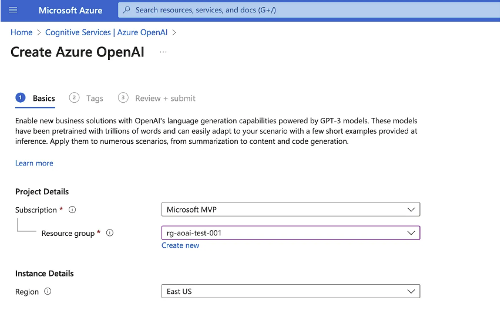
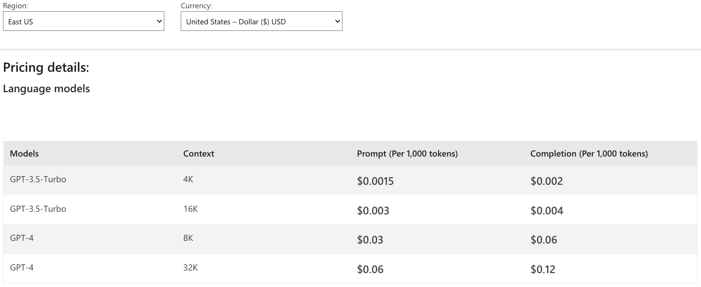
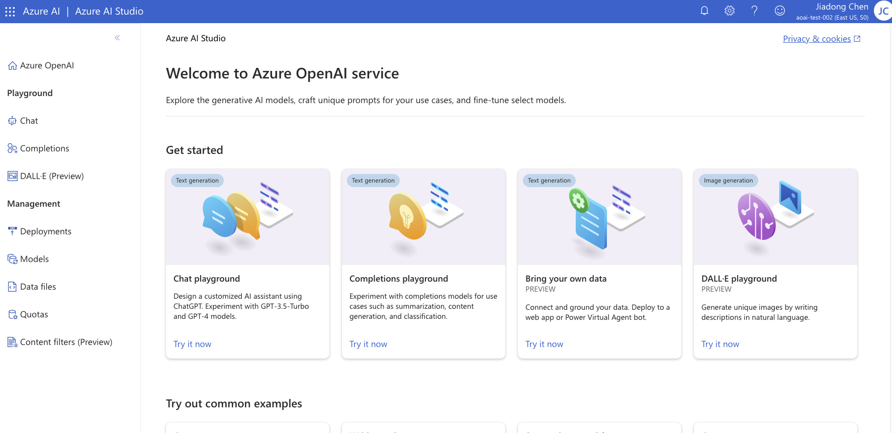
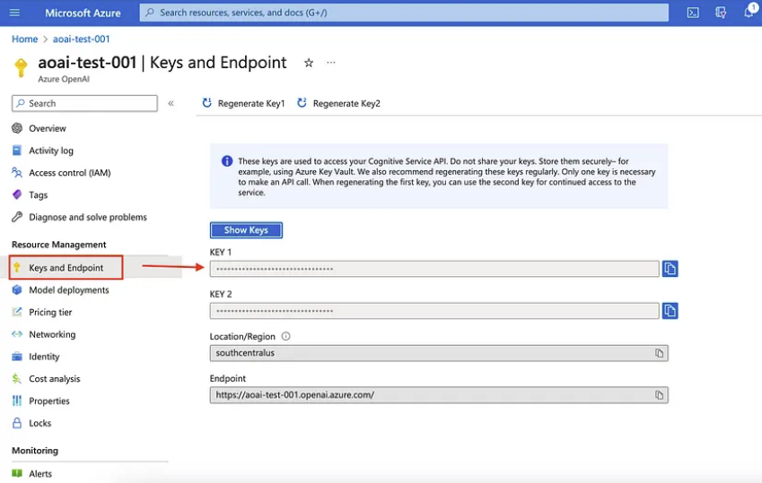

# Tutorial: Integrating Azure OpenAI and Azure Speech Services to Create a Voice-Enabled Chatbot with Python and GPT-4


---

**Principal author**: [Jiadong Chen](https://learn.microsoft.com/users/jiadongchen/)

---

Artificial intelligence (AI) is changing the way businesses operate, and many organizations are looking for ways to leverage AI to improve their operations and gain a competitive advantage. In this tutorial, we’ll explore how to integrate Azure OpenAI service and Azure Speech service to create a chatbot that users can interact with via voice.

In this tutorial, you learn how to:

> [!div class="checklist"]
> * What is the difference between Azure OpenAI and OpenAI
> * Models in Azure OpenAI service
> * Azure OpenAI Studio
> * Develop a Python program that incorporates Azure OpenAI GPT-4 and Azure Speech functionalities

## Prerequisites

- An Azure subscription - Create a [free trial account](https://azure.microsoft.com/free)
- Access to Azure OpenAI Service - https://aka.ms/oaiapply

## What is the difference between Azure OpenAI and OpenAI

Before we dive into the integration process, let’s first understand what Azure OpenAI Service is.

Azure OpenAI Service provides customers with access to advanced language AI capabilities through OpenAI’s GPT-4, GPT-3.5, Codex, and DALL-E models, all with the added security and enterprise support of Azure. Co-developed with OpenAI, Azure OpenAI ensures compatibility and a seamless transition between the two platforms. By using Azure OpenAI, customers can leverage the same models as OpenAI while benefiting from the security features of Microsoft Azure, such as private networking and regional availability. Additionally, Azure OpenAI promotes responsible AI by offering content filtering capabilities.

[What is Azure OpenAI Service?](https://learn.microsoft.com/azure/ai-services/openai/overview?WT.mc_id=DT-MVP-5001664)

Previously, access to Azure OpenAI Service is exclusive to approved enterprise customers and partners, including Microsoft MVP. To gain access, registration is required. Now, Azure OpenAI Service is generally available, but the service still currently requires registration.
If you want to access Azure OpenAI Service, you will need to complete the Request Access to Azure OpenAI Service form first.

https://aka.ms/oaiapply

If your application to access the Azure OpenAI service is approved, then you can create an Azure OpenAI service in your Azure subscription.




## Models in Azure OpenAI service
The Azure OpenAI service offers users access to a range of different models, such as gpt-35-turbo, gpt-35-turbo-16k, gpt-4 and gpt-4-32k, each with its own capabilities and price point. The version of both gpt-35-turbo and gpt-4 models is a new and improved 0613 model version, which comes with the enhanced steerability.



## Sign in to Azure OpenAI Studio
To get started, go to https://oai.azure.com to access Azure OpenAI Studio. Sign in using credentials that have access to your Azure OpenAI resource. You can select the appropriate directory, Azure subscription, and Azure OpenAI resource during or after the sign-in process.



## Develop a Python program that incorporates Azure OpenAI GPT-4 and Azure Speech functionalities
Setting up Azure OpenAI and Azure Speech Services in the Azure portal is quite straightforward. Once created, we can access these services in our code. Let me illustrate this with an example in Python.

### Step 1 - Installing the necessary Python libraries
If you want to integrate the Azure Speech-to-Text and Text-to-Speech functions as well as Azure OpenAI’s language generation capabilities into your Python project, you will need to install the necessary Python libraries. The first library you will need is `azure-cognitiveservices-speech`, which provides access to Azure’s Speech-to-Text and Text-to-Speech services. You can install this library using `pip`, the Python package manager.

The second library you will need is `openai`, which provides access to Azure OpenAI’s language generation API. Again, you can install this library using `pip`. Once you have these libraries installed, you can use them to create a powerful Python program that can recognize speech, generate language, and convert text to speech.


### Step 2 - Setting Up Azure OpenAI and Speech Services in Python
Let’s craft a Python program and configure the Azure OpenAI API credentials, along with the credentials/configurations for Azure’s Speech-to-Text and Text-to-Speech services.

```python
import os
import azure.cognitiveservices.speech as speechsdk
import openai

# Set up Azure OpenAI API credentials
openai.api_type = "azure"
openai.api_base = os.getenv("OPENAI_ENDPOINT")
openai.api_version = "2023-03-15-preview"
openai.api_key = os.getenv("OPENAI_API_KEY")

# Set up Azure Speech-to-Text and Text-to-Speech credentials
speech_key = os.getenv("SPEECH_API_KEY")
service_region = "eastus"
speech_config = speechsdk.SpeechConfig(subscription=speech_key, region=service_region)
speech_config.speech_synthesis_language = "en-NZ"

# Set up the voice configuration
speech_config.speech_synthesis_voice_name = "en-NZ-MollyNeural"
speech_synthesizer = speechsdk.SpeechSynthesizer(speech_config=speech_config)
```

First, let’s take a look at the steps involved in setting up the Azure OpenAI service. For the usage of Azure OpenAI service, it is necessary to furnish the endpoint of the previously generated instance, an Azure OpenAI endpoint looks like the following format:

```
https://{your-resource-name}.openai.azure.com/
```

[Azure OpenAI Service REST API reference](https://learn.microsoft.com/azure/ai-services/openai/reference?WT.mc_id=DT-MVP-5001664)

Moreover, it’s crucial to specify the API version when utilizing the GPT-4 models to generate chat message completions. 

[Supported versions](https://learn.microsoft.com/azure/ai-services/openai/reference?WT.mc_id=DT-MVP-5001664)

To access the Azure OpenAI service from your Python code, the next step involves providing the API key. This key can be located in the Keys and Endpoint panel of your Azure OpenAI service, as shown below.



Likewise, it is necessary to establish the Azure Speech service. In this case, I have opted for the `en-NZ-MollyNeural` voice, which emulates the accent of New Zealanders, also known as Kiwis.

The link below provides access to information on the languages and voice support available for the Speech service.

[Language and voice support for the Speech service](https://learn.microsoft.com/azure/ai-services/speech-service/language-support?tabs=tts&WT.mc_id=DT-MVP-5001664)


### Step 3 - Creating a speech recognizer and starting the recognition
To converse with a chatbot powered by GPT-4 in a human-like conversation, the first step is to create a speech recognizer capable of identifying our voice.

```python
# Define the speech-to-text function
def speech_to_text():
    # Set up the audio configuration
    audio_config = speechsdk.audio.AudioConfig(use_default_microphone=True)

    # Create a speech recognizer and start the recognition
    speech_recognizer = speechsdk.SpeechRecognizer(speech_config=speech_config, audio_config=audio_config)
    print("Say something...")

    result = speech_recognizer.recognize_once_async().get()

    if result.reason == speechsdk.ResultReason.RecognizedSpeech:
        return result.text
    elif result.reason == speechsdk.ResultReason.NoMatch:
        return "Sorry, I didn't catch that."
    elif result.reason == speechsdk.ResultReason.Canceled:
        return "Recognition canceled."
```

In the code above, we define a function named `speech_to_text` that uses the Microsoft Azure Speech Service SDK to perform speech-to-text conversion. It sets up the audio configuration and creates a speech recognizer object, which is configured using the Speech Service’s language and authentication credentials. The function prompts the user to speak and starts the recognition process asynchronously using the `recognize_once_async()` method. Once the recognition is completed, the function checks the “reason” attribute of the “result” object to determine if the speech was recognized successfully or not. If it was recognized, the function returns the recognized text, otherwise it returns an error message.

### Step 4 - Using Azure OpenAI’s GPT-4 engine to generate text in response to a prompt
After getting input from the user using speech-to-text in the previous step, we can use the input as the prompt in Azure OpenAI’s GPT-4 engine.

```python
# Define the Azure OpenAI language generation function
def generate_text(prompt):
    response = openai.ChatCompletion.create(
        engine="chenjd-test",
        messages=[
            {"role": "system", "content": "You are an AI assistant that helps people find information."},
            {"role": "user", "content": prompt}
        ],
        temperature=0.7,
        max_tokens=800,
        top_p=0.95,
        frequency_penalty=0,
        presence_penalty=0,
        stop=None
    )
    return response['choices'][0]['message']['content']
```
This Python code above defines a function called `generate_text` that uses Azure OpenAI's GPT-4 engine to generate text in response to a prompt.

The function takes a prompt as input and uses the `openai.ChatCompletion.create()` method to generate a response, with parameters like engine, messages, temperature, max_tokens, top_p, frequency_penalty, presence_penalty, and stop.

The main input of the `openai.ChatCompletion.create()` method is the messages parameter, which should be an array consisting of message objects. Each message object in the array must include a “role” (which can be either “system”, “user”, or “assistant”) and a “content” field (which contains the message’s content, in this case, the message’s content is the value of prompt).


### Step 5 - Adding Text-to-Speech Functionality to the Chatbot
Let’s now include another feature that allows the chatbot to vocalize the text produced by the Azure OpenAI service in a human-like manner.

```python
# Define the text-to-speech function
def text_to_speech(text):
    try:
        result = speech_synthesizer.speak_text_async(text).get()
        if result.reason == speechsdk.ResultReason.SynthesizingAudioCompleted:
            print("Text-to-speech conversion successful.")
            return True
        else:
            print(f"Error synthesizing audio: {result}")
            return False
    except Exception as ex:
        print(f"Error synthesizing audio: {ex}")
        return False
```

This Python code defines a function called `text_to_speech` that takes a `text` parameter, which is generated by Azure OpenAI, as input. It uses the `speech_synthesizer` object to asynchronously synthesize the input text and generate speech audio using the `en-NZ-MollyNeural` voice.

As the end result, you can click on the video below to check out this chat bot that can communicate with humans by voice.

[Video - Voice Enabled Chatbot](https://www.youtube.com/watch?v=I08pmoEMiqU)

## Clean up resources

If you're not going to continue to use this application, delete the Azure OpenAI resource or resource group from the Azure Portal.


## Next steps
- [Azure OpenAI Service REST API reference](https://learn.microsoft.com/azure/ai-services/openai/reference?WT.mc_id=DT-MVP-5001664)
- [Azure OpenAI Samples GitHub repository](https://github.com/Azure-Samples/openai)


